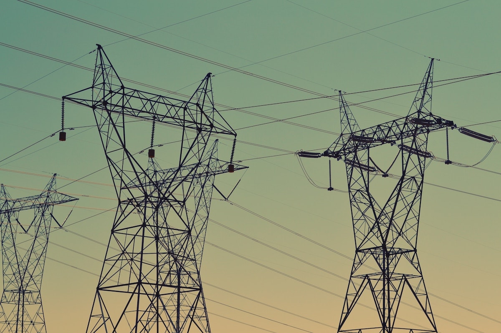
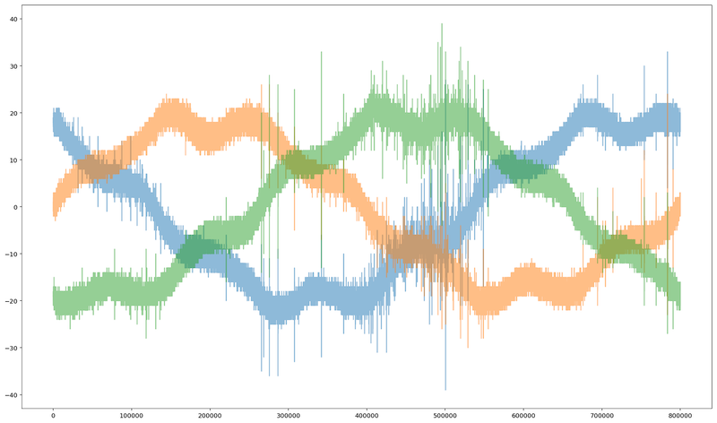
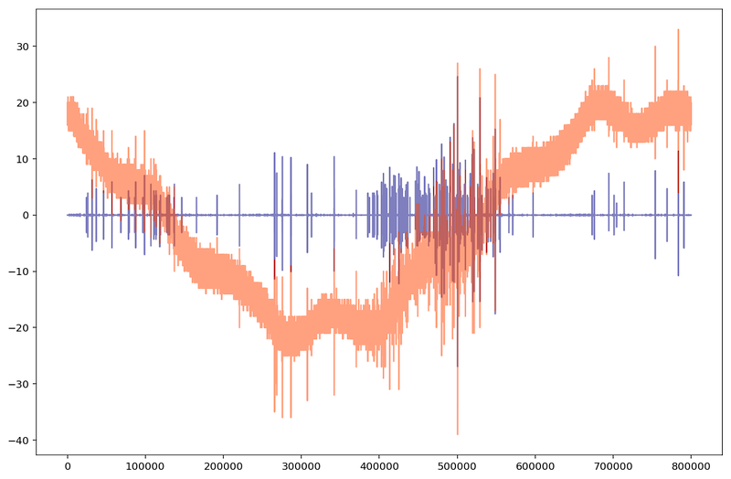

# My Approach to Solve Kaggle's VSB Power Line Fault Detection Competition



In this document, I will briefly explain my way of solving the VSB Power Line Fault Detection competition. The metric used in that competition was Matthews correlation coefficient (MCC) between the predicted and the observed response. My final score was 0.58655; the best score was 0.71899 (a difference of 0.13244); the worst score was -0.28109.

The goal of the competition was to detect partial discharge patterns in signals acquired from power lines. The competition data consists of 800,000 readings for around 29,000 signals (8712 for training and the rest for testing). For each signal, we need to determine if it has a partial discharge or not. The signal data contains a lot of background noise according to the competition organizers.

# 1. Exploratory Data Analysis (EDA)

EDA is the process that I started with and continued using throughout the competition to understand the data, to spot some useful patterns, and to choose proper parameters for some functions.

The image below shows the 3 phases of some signal:



# 2. The Submission Code

The submission code is the code used to produce the submission file that competitors submit to Kaggle. 

## Reading the Data

The signal readings were provided in [Parquet format](https://en.wikipedia.org/wiki/Apache_Parquet) which is a column-oriented storage format of the Apache Hadoop ecosystem. To read this data in Python and store it Pandas dataframe, we used a function from `pyarrow` package, then transposed the output of the function to get a row-oriented storage format. 

## Feature Engineering

This is the most important part and the one that took most of the time. Because each of the signals has 800,000 readings, it's essential that we extract features from those readings in order to build a proper training and test datasets. Training a model with 800,000 features is not feasible with the machines that we have access to. In this part, for each of the training and test signals, I did the following:

### Signal Filtering

All the operations described below are done after filtering the signals that contain a lot of noise as described above. To do so, we applied [Scikit-image's wavelet denoising](http://scikit-image.org/docs/dev/auto_examples/filters/plot_denoise_wavelet.html) followed by [Scipy's Butterworth filter](https://docs.scipy.org/doc/scipy/reference/generated/scipy.signal.butter.html). The image below shows the same signal before filtering (in orange) and after filtering (in blue). The overlapping is shown in dark red:



### Peak Calculation

I used Scipy's `scipy.signal.find_peaks` function to extract useful features from the signals. Here is a part of [Scipy documentation about `find_peaks`](https://docs.scipy.org/doc/scipy/reference/generated/scipy.signal.find_peaks.html) function:

> Find peaks inside a signal based on peak properties.
>
> This function takes a one-dimensional array and finds all local maxima by simple comparison of neighbouring values. Optionally, a subset of these peaks can be selected by specifying conditions for a peak’s properties.

I used this function with different parameter combinations. For example, one time I used it to find peaks in the signal whose height is more than 5; another time for when the height is bigger than 15; another for when peak height is bigger than 15 and the horizontal distance between neighboring peaks is more than 25 samples; another for when peak height is bigger than 25 and peak width is more than 10 samples; etc. I also used Scipy's `scipy.signal.peak_prominences` and `scipy.signal.peak_widths` to get the maximum and minimum peak prominence and width. This gave us around 140 features.

I performed the peak calculation process described above to calculate negative peaks. For example, to get the peaks whose height is bigger than 5 (positive peaks), you would write:

```python
scipy.signal.find_peaks(signal, height=(5, None))
```

But if you want the corresponding negative peaks (peaks whose height is smaller than -5), you would write:

```python
scipy.signal.find_peaks(signal, height=(None, -5))
```

### Signal Statistical Info

I used Numpy to calculate some statistics of the signals like the mean, standard deviation, minimum, maximum, skewness, 30th percentile, 70th percentile, etc.

### Feature Selection

I used LightGBM's `feature_importance` function to get the most important features so instead of around 300 features, we selected the most important 68 features and then added features that represent the subtraction of some features from others; that's because we calculated peak information for positive and negative peaks, so I figured that it might be useful to subtract the features of negative peaks from the features of positive peaks.

## Modeling

For modeling, I used multiple classification models where each model predicts the probability of the existence of partial discharge in some signal, then the probabilities produced by all models are added and averaged (weighted average), and finally, a threshold value is used to convert the final probability to 0 or 1 (for example, if the probability is less than 0.51, then 1, else 0).

The models used are: LightGBM, XGBoost, CatBoost, Scikit-learn's K Nearest Neighbors, Scikit-learn's Neural Network, Scikit-learn's Logistic Regression, Scikit-learn's Gaussian Naive Bayes.

The code used is available in [this Github repository](https://github.com/ammar1y/My-Solution-to-VSB-Power-Line-Fault-Detection-Competition). First `final_v1` is run and the resulting dataframe is stored, then the same for `final_v2`, and finally `final_sub` is run which use the dataframes produced by the former two.

